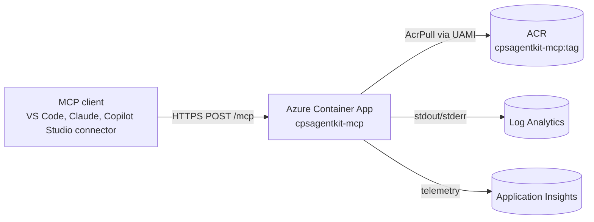

# Deploying the Agent Workbench for Copilot Studio MCP Server to Azure

The MCP server runs as a public, anonymous endpoint on **Azure Container Apps**, with images stored in **Azure Container Registry** and pulled via a user-assigned managed identity.

## Live endpoint

| | |
|---|---|
| Resource group | `rg-cpsagentkit-mcp` (uksouth) |
| Default URL | `https://ca-mcp-6frsoq6bw5vuk.salmonstone-8b839f60.uksouth.azurecontainerapps.io/mcp` |
| Health probe | `GET /healthz` |
| Auth | Anonymous (data is non-sensitive). Optional `MCP_API_KEY` secret enables `x-api-key` / Bearer auth. |
| Custom domain | `cpsagentkit.codeworks.app` (pending DNS — see below) |

## Architecture



Resources (single resource group, all in `uksouth`):

| Type | Name pattern |
|---|---|
| `Microsoft.OperationalInsights/workspaces` | `log-<token>` |
| `Microsoft.Insights/components` | `appi-<token>` |
| `Microsoft.ContainerRegistry/registries` | `acr<token>cps` |
| `Microsoft.ManagedIdentity/userAssignedIdentities` | `id-<token>` |
| `Microsoft.App/managedEnvironments` | `cae-<token>` |
| `Microsoft.App/containerApps` | `ca-mcp-<token>` |

## Hosted-mode tool filter

When the server starts with `MCP_HOSTED=1` (always set in the deployed container) it skips registration of any tool that requires the **client's** local filesystem. Remote callers see only:

- `cps_list_knowledge_topics`
- `cps_get_knowledge`
- `cps_get_best_practice`
- `cps_validate_tool_description`
- `cps_parse_prompt_config`
- `cps_build_prompt_update`

The workspace-parsing and assessment tools (`cps_parse_solution`, `cps_compose_review_prompt`, etc.) remain available via the stdio transport when running locally.

## First-time deploy

```pwsh
# 1. Sign in and select the subscription.
az login
az account set --subscription <subscription-id>

# 2. Register providers (one-off per subscription).
az provider register -n Microsoft.App
az provider register -n Microsoft.ContainerRegistry

# 3. Create the resource group.
az group create -n rg-cpsagentkit-mcp -l uksouth

# 4. Provision infrastructure. The initial image is a placeholder; the real
#    image is built in step 5 and rolled out in step 6.
az deployment group create `
  -g rg-cpsagentkit-mcp `
  -n mcp-initial `
  -f packages/mcp-server/infra/main.bicep `
  -p environmentName=cpsagentkit-mcp `
  -p location=uksouth

# Capture outputs.
$acr = az deployment group show -g rg-cpsagentkit-mcp -n mcp-initial --query "properties.outputs.AZURE_CONTAINER_REGISTRY_NAME.value" -o tsv
$app = az deployment group show -g rg-cpsagentkit-mcp -n mcp-initial --query "properties.outputs.AZURE_CONTAINER_APP_NAME.value" -o tsv

# 5. Build and push the image from the monorepo root.
$tag = "0.15.23-$(Get-Date -UFormat %s)"
az acr build `
  --registry $acr `
  --image "cpsagentkit-mcp:$tag" `
  --image "cpsagentkit-mcp:latest" `
  --file packages/mcp-server/Dockerfile `
  --no-logs `
  .

# 6. Roll out the new revision.
az containerapp update -g rg-cpsagentkit-mcp -n $app `
  --image "$acr.azurecr.io/cpsagentkit-mcp:$tag"
```

> **Windows / `az acr build` log streaming bug.** The Azure CLI on Windows can crash while streaming ACR build logs that contain non-cp1252 glyphs (e.g. esbuild's ⚡ banner). Pass `--no-logs` and inspect builds with `az acr task list-runs -r <acr> -o table`. To view the actual log text, fetch the SAS URL via `az rest`:
>
> ```pwsh
> $sas = az rest --method POST `
>   --uri "https://management.azure.com/subscriptions/<sub>/resourceGroups/rg-cpsagentkit-mcp/providers/Microsoft.ContainerRegistry/registries/<acr>/runs/<runId>/listLogSasUrl?api-version=2019-06-01-preview" `
>   --query "logLink" -o tsv
> Invoke-WebRequest -Uri $sas -OutFile build.log -UseBasicParsing
> ```

## Updating the deployed image

Re-run steps 5 and 6 above. The Container App keeps the previous revision; if anything goes wrong, revert with:

```pwsh
az containerapp revision activate -g rg-cpsagentkit-mcp -n $app --revision <previous-revision-name>
```

## Enabling the optional API key

Set the secret and the corresponding env var without redeploying infra:

```pwsh
$key = "<random-string>"
az containerapp secret set -g rg-cpsagentkit-mcp -n ca-mcp-6frsoq6bw5vuk `
  --secrets mcp-api-key=$key
az containerapp update -g rg-cpsagentkit-mcp -n ca-mcp-6frsoq6bw5vuk `
  --set-env-vars MCP_API_KEY=secretref:mcp-api-key
```

Clients then send `x-api-key: <key>` (or `Authorization: Bearer <key>`) on every `/mcp` POST.

## Custom domain — `cpsagentkit.codeworks.app`

> **Brand rename note (Agent Workbench).** The existing hostname `cpsagentkit.codeworks.app`, resource group `rg-cpsagentkit-mcp`, Container App name, and ACR image tag are **intentionally retained** as part of the rename to Agent Workbench for Copilot Studio. They are addressable URLs/IDs only; renaming would force a redeploy with downtime and break any pinned clients. A future migration to `agent-workbench.codeworks.app` can be done non-disruptively by binding the second hostname to the same Container App (both managed certs valid simultaneously) and updating client configs at leisure.

1. Get the verification ID and ingress FQDN (already provisioned, no Bicep change required):
   ```pwsh
   az containerapp show -g rg-cpsagentkit-mcp -n ca-mcp-6frsoq6bw5vuk `
     --query "{vid:properties.customDomainVerificationId, fqdn:properties.configuration.ingress.fqdn}" -o json
   ```
2. At your DNS provider for `codeworks.app`, create two records:

   | Type | Name | Value |
   |---|---|---|
   | `CNAME` | `cpsagentkit` | `ca-mcp-6frsoq6bw5vuk.salmonstone-8b839f60.uksouth.azurecontainerapps.io` |
   | `TXT` | `asuid.cpsagentkit` | `487C42F048D0B931F4E5A22C201BC2090A43BCA55DDFABEBDF042271AAD956D2` |

3. Wait for DNS propagation (`Resolve-DnsName cpsagentkit.codeworks.app -Type CNAME`), then bind with a Container Apps managed certificate:
   ```pwsh
   az containerapp hostname add `
     -g rg-cpsagentkit-mcp -n ca-mcp-6frsoq6bw5vuk `
     --hostname cpsagentkit.codeworks.app
   az containerapp hostname bind `
     -g rg-cpsagentkit-mcp -n ca-mcp-6frsoq6bw5vuk `
     --hostname cpsagentkit.codeworks.app `
     --environment cae-6frsoq6bw5vuk `
     --validation-method CNAME
   ```
   The CLI provisions a free managed TLS certificate (issuance can take a few minutes).

## Observability

Tail logs:

```pwsh
az containerapp logs show -g rg-cpsagentkit-mcp -n ca-mcp-6frsoq6bw5vuk --follow
```

Or query Log Analytics:

```kql
ContainerAppConsoleLogs_CL
| where ContainerAppName_s == "ca-mcp-6frsoq6bw5vuk"
| order by TimeGenerated desc
| take 100
```

Application Insights is provisioned and its connection string is injected as `APPLICATIONINSIGHTS_CONNECTION_STRING`. The server does not currently auto-init the AI SDK; opt in by `npm install applicationinsights` and wiring it from `bin.ts` when the env var is set.

## Smoke test

```pwsh
$base = "https://ca-mcp-6frsoq6bw5vuk.salmonstone-8b839f60.uksouth.azurecontainerapps.io"

# Health
Invoke-WebRequest "$base/healthz" -UseBasicParsing | Select-Object -ExpandProperty Content

# Initialize a session
$hdr = @{ "Accept" = "application/json, text/event-stream"; "Content-Type" = "application/json" }
$init = '{"jsonrpc":"2.0","id":1,"method":"initialize","params":{"protocolVersion":"2024-11-05","capabilities":{},"clientInfo":{"name":"smoke","version":"1.0"}}}'
$r = Invoke-WebRequest -Uri "$base/mcp" -Method POST -Headers $hdr -Body $init -UseBasicParsing
$sid = [string]$r.Headers['mcp-session-id']
$hdr['mcp-session-id'] = $sid

Invoke-WebRequest -Uri "$base/mcp" -Method POST -Headers $hdr `
  -Body '{"jsonrpc":"2.0","method":"notifications/initialized"}' -UseBasicParsing | Out-Null

# List tools
$r = Invoke-WebRequest -Uri "$base/mcp" -Method POST -Headers $hdr `
  -Body '{"jsonrpc":"2.0","id":2,"method":"tools/list"}' -UseBasicParsing
(($r.Content -split 'data: ',2)[1].Trim() | ConvertFrom-Json).result.tools.name
```

## Adding the hosted endpoint to an MCP client

VS Code `.vscode/mcp.json`:

```jsonc
{
  "servers": {
    "cpsagentkit-hosted": {
      "type": "http",
      "url": "https://cpsagentkit.codeworks.app/mcp"
    }
  }
}
```

(Substitute the `*.azurecontainerapps.io` URL until the custom domain is bound.)
